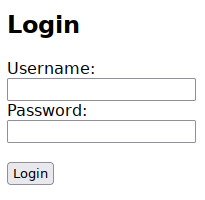
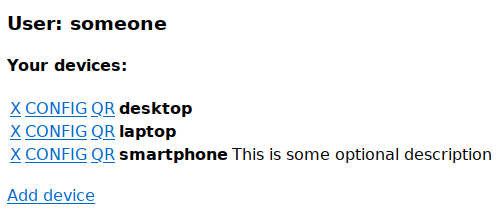
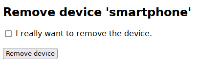
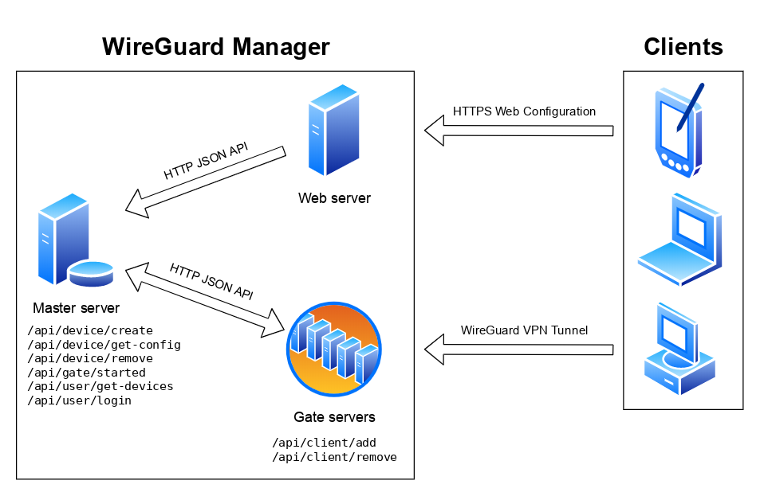

# zcu-kiv-pd-wgmanager

TODO

--------------------------------------------------------------------------------



--------------------------------------------------------------------------------



--------------------------------------------------------------------------------



--------------------------------------------------------------------------------

TODO

## Architecture



TODO

## Installation

### Dependencies

| Tool              | Gate | Master | Web |
| :---------------: | :--: | :----: | :-: |
| `base64`          |      | X      | X   |
| `busybox` (httpd) | X    | X      |     |
| `cat`             | X    | X      |     |
| `chown`           |      | X      |     |
| `curl`            | X    | X      | X   |
| `cut`             | X    | X      | X   |
| `date`            |      | X      |     |
| `dirname`         | X    | X      | X   |
| `echo` (with -e)  |      |        | X   |
| `find`            |      | X      |     |
| `flock`           |      | X      |     |
| `grep`            |      | X      | X   |
| `head`            |      | X      |     |
| `htpasswd`        |      | X      |     |
| `ip`              | X    |        |     |
| `jq`              | X    | X      | X   |
| `mkdir`           |      | X      |     |
| `openssl`         |      | X      | X   |
| `qrencode`        |      |        | X   |
| `rev`             |      | X      |     |
| `rm`              |      | X      |     |
| `sed`             |      | X      | X   |
| `sort`            |      | X      |     |
| `stat`            |      | X      |     |
| `stty`            |      | X      |     |
| `touch`           |      | X      |     |
| `uniq`            |      | X      |     |
| `wc`              | X    | X      | X   |
| `wg`              | X    | X      |     |
| `xargs`           |      |        | X   |

Gate server also needs WireGuard kernel module.
Web server requires some HTTP server with CGI. Simple httpd from `busybox` is enough.

If you use Debian, you can install everything needed with the following command:
```
# apt install apache2-utils busybox coreutils curl findutils grep iproute2 \
jq openssl qrencode sed util-linux wireguard wireguard-tools
```

### Gate server configuration

Move to the gate server directory:
```
# cd /var/lib/wgmanager/gate
```

Generate a WireGuard key pair for the gate server:
```
# wg genkey | tee > private-key | wg pubkey > public-key
```

Generate a common WireGuard preshared key (PSK), which is the same for all gate servers:
```
# wg genpsk > preshared-key
```

Set file permissions:
```
# chmod 600 private-key preshared-key
```

Change additional options in the `gate.cfg` file if needed. See comments in there.

### Master server configuration

Create a user for the HTTP API server of the master server:
```
# useradd --home-dir /var/lib/wgmanager --system --shell /usr/sbin/nologin
```

Move to the master server directory:
```
# cd /var/lib/wgmanager/master
```

Generate a RSA key pair for the master server:
```
# openssl genrsa -out private-key.pem 2048
# openssl rsa -pubout -outform PEM -in private-key.pem -out public-key.pem
```

Set file permissions:
```
# chown root:wgmanager master.cfg private-key.pem
# chown wgmanager:wgmanager . db pool-ipv4 pool-ipv6 shadow
# chmod 640 master.cfg private-key.pem
# chmod 600 shadow
```

Set the following options in the `master.cfg` file:
- `PRESHARED_KEY`: The common preshared key used by all gate servers and stored in their `preshared-key` file.
- `GATE_SERVERS`: Public IP address and public key of each gate server.

Change additional options in the `master.cfg` file if needed. See comments in there.

### Web server configuration

Move to the web server directory:
```
# cd /var/lib/wgmanager/web
```

Copy the master server public key:
```
# cp ../master/public-key.pem master-server-key.pem
```

Change additional options in the `web.cfg` file if needed. See comments in there.

## Running

Copy the included `wgmanager-gate.service` and `wgmanager-master.service` file to `/etc/systemd/system` and run them:
```
# systemctl start wgmanager-master
# systemctl start wgmanager-gate
```

For web server, you can use simple httpd from `busybox` as well:
```
$ busybox httpd -f -v -p 80 -h /var/lib/wgmanager/web/www
```

However, you can also use the existing big web server, such as Apache, nginx, lighttpd and so on. To do it, set the
`/var/lib/wgmanager/web/www` as a document root and activate the CGI module for the `cgi-bin` subdirectory. Note that
all non-standard modifications of CGI variables, such as automatic conversion of `%2F` to `/`, must be disabled.
